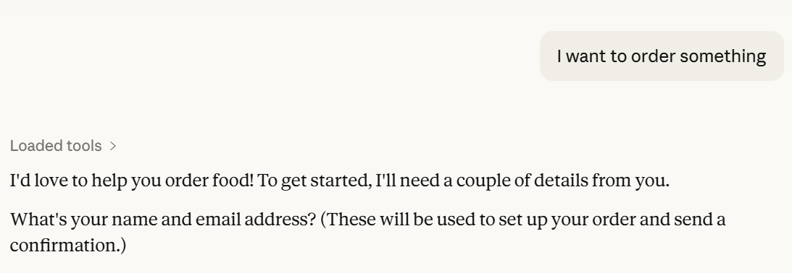
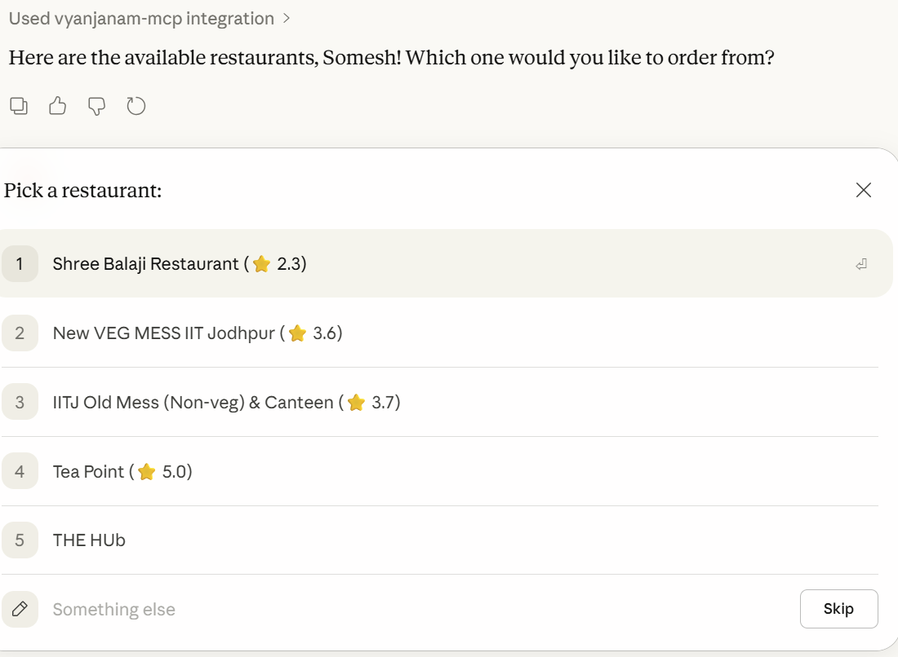
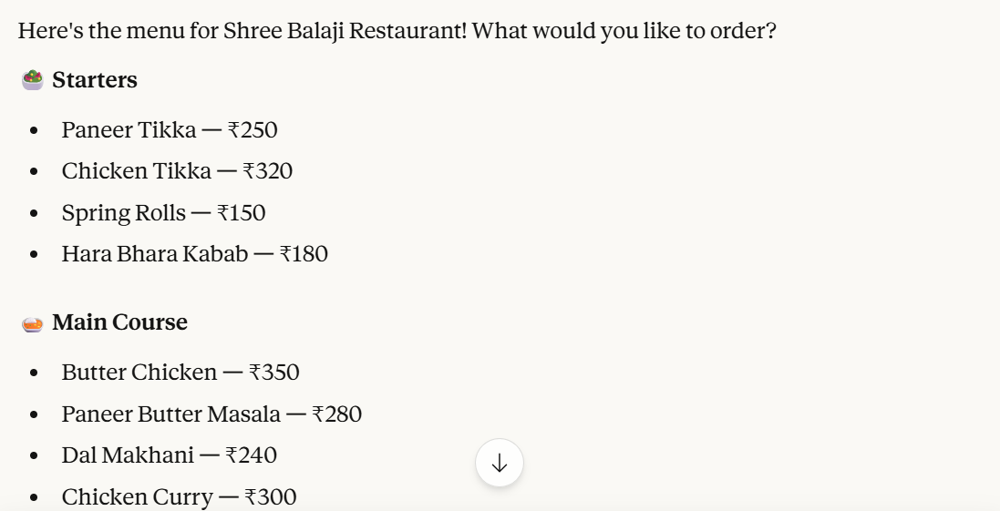
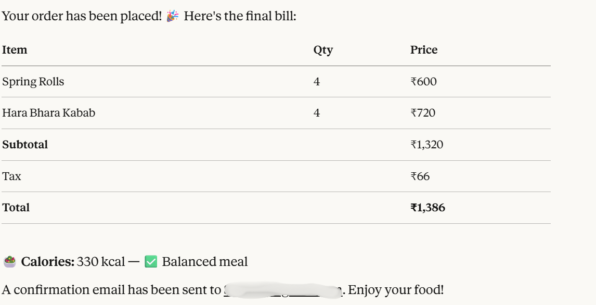
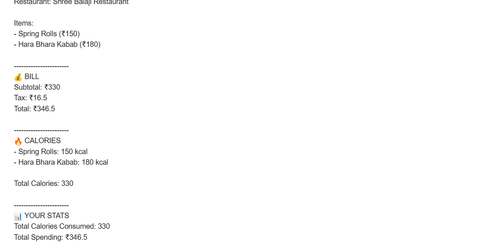

# 🍽️ Vyanjanam AI – Intelligent Food Ordering MCP System

Vyanjanam AI is an end-to-end AI-powered food ordering system built using MCP (Model Context Protocol).

It allows users to:
- Discover nearby restaurants
- Select food items
- Generate bills
- Track calorie intake
- Receive email summaries

All through a guided conversational AI workflow.

---
## ✨ Features

- 🔍 Find nearby restaurants (Google Places API)
- 🍴 Browse and select menu items
- 🧾 Automatic bill generation
- 🔥 Calorie calculation per order
- 👤 User tracking (calories + spending)
- 📧 Email summary after every order
- 🧠 Guided conversational AI flow (MCP)

---
## 🏗️ Project Structure

```
vyanjanam/
│
├── main.py
│
├── modules/
│ ├── restaurant_finder.py
│ ├── menu_manager.py
│ ├── order_manager.py
│ ├── calorie_manager.py
│ ├── user_manager.py
│ ├── email_manager.py
│
├── utils/
│ ├── emails.py
│ ├── location.py
│ ├── calorie_db.py
│
├── calories.db
├── .env
├── screenshots/
```
---
## ⚡ MCP Configuration (Recommended)

This project is designed to run via MCP (Model Context Protocol).  
You **do NOT need to manually run `main.py`** if MCP is configured correctly.

### Example MCP Configuration

```json
{
  "mcpServers": {
    "vyanjanam-mcp": {
      "command": "path-to-uv-executable",
      "args": [
        "run",
        "--with",
        "mcp[cli]",
        "mcp",
        "run",
        "path-to-project/main.py"
      ],
      "env": {
        "GOOGLE_API_KEY": "<your_google_api_key>",
        "EMAIL": "<your_email>",
        "EMAIL_PWD": "<your_app_password>"
      }
    }
  }
}
```
---
## ⚙️ Setup Instructions

### 1️⃣ Clone the Repository
```bash
git clone https://github.com/joshisomesh1996-star/vyanjanam.git
cd vyanjanam
```
### 2️⃣ Install Dependencies (using uv)
```
uv sync
```
### 3️⃣ Create & Activate Virtual Environment
```
uv venv
source .venv/bin/activate     # Mac/Linux
.venv\Scripts\activate        # Windows
```
### 4️⃣ Setup Environment Variables
```
GOOGLE_API_KEY=your_google_api_key
EMAIL=your_email@gmail.com
EMAIL_PWD=your_app_password
```
### 5️⃣ Initialize Database
```
python utils/calorie_db.py
```
### 6️⃣ Run MCP via Claude
```
Start Claude Desktop (or MCP client).  
The server will automatically start using your MCP configuration.
```

---
## 📸 Screenshots

### 🔹 User starts conversation
<p align="left">
  
</p>

### 🔹 Restaurant Selection
<p align="left">
  
</p>

### 🔹 Menu Selection
<p align="left">
  
</p>

### 🔹 Order Summary
<p align="left">
  
</p>

### 🔹 Email Output
<p align="left">
  
</p>

---
## 🧠 Tech Stack

- Python
- MCP (Model Context Protocol)
- SQLite
- Google Places API
- SMTP (Email)
- dotenv
---
## 👨‍💻 Author

Somesh Joshi
---
## ⭐ Show Your Support

If you liked this project, please ⭐ the repository!